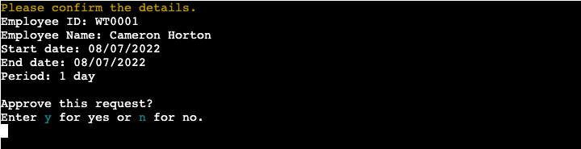

# WORK TIME - Employee Time Management System

_WORK TIME_ is an employee time management system which runs in an SSH terminal in a browser. The application will be targeted towards small business owners that are looking for an effective way to manage their employees' schedules. It provides an employee clocking system, attendance tracking and absence management.


### View the live project [here](https://work--time.herokuapp.com/)

__NOTE__: This application can only be operated properly on a desktop computer browser.

<br>

# Table of Contents

[User Experience (UX)](#user-experience-ux)
- [Application Goals](#application-goals)
- [Target Audience](#target-audience)
- [User Stories](#user-stories)
- [Strategy Table / Diagram](#strategy-table--diagram)
- [Application Structure](#application-structure)
- [Wireframe](#wireframe)

[Technical Design](#technical-design)
- [Flowchart](#flowchart)
- [Data Model](#data-model)

[Features](#features)
- [Implemented Features](#implemented-features)
- [Features Left to Implement](#features-left-to-implement)

[Technologies Used](#technologies-used)
- [Languages](#languages)
- [Libraries](#libraries)
- [Programs](#programs)

[Testing](#testing)
- [Testing User Stories](#testing-user-stories-from-the-user-experience-ux-section)
- [Code Validation](#code-validation)
- [Functionality Testing](#functionality-testing)
- [Performance Testing](#performance-testing)
- [Bugs](#bugs)

[Deployment](#deployment)
- [Heroku](#heroku)
- [Making a Local Clone](#making-a-local-clone)
- [Forking this Repository](#forking-this-repository)

[Credits](#credits)
- [Code](#code)
- [Inspiration](#inspiration)
- [Acknowledgements](#acknowledgements)

<br>

# User Experience (UX)

## Application Goals

- To provide a time management system that optimises the productivity of employees by automating idle routines such as recording clocking times, time-off entitlements and group absences.
- To deliver information as intuitively as possible by providing descriptive messages and a clear content structure.

## Target Audience

small business owners, supervisors and their employees

## User Stories

- As a superuser (business owner / supervisor),
    - I want the login credentials to be secure so that an unauthorised person cannot access the admin account.
    - I want to be able to reset my password so that I can access the system even when I forget it.
    - I want to be able to review each employee's attendance record so that I can manage the team more effectively.
    - I want to be able to review a list of all requests easily so that I don't miss anything.
    - I want to be able to see the team's availability so that I can easily determine whether I can approve or reject new absence requests.
    - I want to be notified when there's a new request so that I can proceed as soon as possible.
    - I want the system to programmatically generate payslips so that I can avoid idle and error-prone routines.
    - I want to be able to add a new employee to the system so that they can start using the system immediately.

<br>

- As a user (employee),
    - I want a simple log-in process so that I can complete my task as quickly as possible.
    - I want an easy-to-use system so that I can complete my task as quickly as possible.
    - I want to be able to check my absence entitlements so that I can plan my holidays as quickly as possible.
    - I want to be able to book and cancel my holidays on the system so that I don't have to email my manager or update it on the Excel spreadsheet.
    - I want to be able to review worked hours so that I can flag it to the manager immediately if it's inaccurate.
    - I want to be able to check who's out of the office at a glance so that I can arrange meetings / events on a day when the relevant members are in.

## Strategy Table / Diagram

The strategy table and diagram have been created to decide on what features should be implemented in this project. The listed features are based on the user stories. Each feature's importance and viability / feasibility were rated on a scale of 1 to 5 where 5 is the most important and the most viable / feasible.

<details>
    <summary>View Strategy Table and Diagram</summary>
    
</details>

<br>

## Application Structure

Based on the strategy rating, I have decided to implement the following features: Login(Feature ID 1), Clock in/out(3), Book/Cancel/Approve/Reject time-off(4), Review Clock in/out time(7), Review absence entitlements(8), Review group absence(9).

The application will be structured as shown in the following diagram.

<details>
    <summary>View Diagram</summary>
    
</details>

<br>

## Wireframe

<details>
    <summary>View Wireframe</summary>
    
</details>

<br>

[Back To **Table of Contents**](#table-of-contents)

<br>

# Technical Design

## Flowchart

<details>
    <summary>View Flowchart</summary>
    
</details>

<br>

## Data Model

_Google Sheets_ was chosen to store and retrieve data as most small/start-up companies typically have this tool available and the volume of the data for this project will be small. The python implementation will be able to support a SQL or NoSQL database with minimal refactoring when the volume of data requires it.
The spreadsheet has 5 worksheets: login_credentials, employees, clockings, absences_requests and entitlements.
 
Each employee's login ID will be stored in the login_credentials sheet and will be the key to link to other worksheets to CRUD(create, read, update, delete) data when the user interacts with the application.
 
I have created a diagram to visualise each sheet and its columns.

<details>
    <summary>View Diagram</summary>
    
</details>

The spreadsheet can be found [here](https://docs.google.com/spreadsheets/d/1yBUMfb2aVQdtDsvj2FyMLVSAgK2HFpPF_FO3ZXAN37s/edit?usp=sharing)

[Back To **Table of Contents**](#table-of-contents)

<br>

# Features

## Implemented Features

- The application layout splits functionality across 2 frames: a terminal and a calendar. The application's main features are utilised via the terminal.

- Each user input is validated, feedback is given if invalid and the input prompt is repeated until the user enters valid input. The user can also type __menu__ or __quit__ if deciding to return to the menu or exit the application.

- Feedback is given when the user's request is processed and data is updated to _Google Sheets_. If the user decides not to continue further, a message shows that no changes are made.

- Application commands are not case-sensitive for convenience.

__NOTE__: The application is set for a fictional company that is based in Ireland, has 10 employees and 1 manager, each employee works 9:30-5:30 on weekdays and has 25 annual leave entitlements.

- Main Title and Login

    - When starting the program, the title and login prompt display for quick access to the system.

        <details>
            <summary>Main Title and Login Screenshot</summary>
            
        </details>

    - At the employee ID prompt, the user can access a brief description of the application by typing __help__.

        <details>
            <summary>Help Screenshot</summary>
            
        </details>

- Employee Portal

    - Title

        - When an employee logs into the system, they can see the employee portal title, welcome message with their first name and menu.

            <details>
                <summary>Employee Portal Title Screenshot</summary>
                
            </details>

    - Clock In

        - As soon as the logged-in employee types 1 at the menu, the clock in time is added to the worksheet.

            <details>
                <summary>Clock In Screenshot</summary>
                
            </details>

        - If the employee already clocked in that day, the alert displays to notify them and asks if they want to overwrite the time.

            <details>
                <summary>Clock In Alert 1 Screenshot</summary>
                
            </details>

        - If the employee already clocked out that day, the alert displays to notify them. In that case, only the admin can update the time.

            <details>
                <summary>Clock In Alert 2 Screenshot</summary>
                
            </details>

    - Clock out

        - As soon as the logged-in employee types 2 at the menu, the clock out time is added to the worksheet.

            <details>
                <summary>Clock Out Screenshot</summary>
                
            </details>

        - If the employee did not clock in that day, the alert displays to notify them.

            <details>
                <summary>Clock Out Alert 1 Screenshot</summary>
                
            </details>

        - If the employee already clocked out that day, the alert displays to notify them. In this case, the clock out time is not updated.

            <details>
                <summary>Clock Out Alert 2 Screenshot</summary>
                
            </details>

    - View Clock Card

        - The logged-in employee's clock card for the current week is displayed by default. They can view another week's clock card by typing a date in the correct format.

            <details>
                <summary>Clock Card Display Screenshot</summary>
                
            </details>

    - View Absence Entitlements

        - The logged-in employee's annual absence entitlements are displayed in a table with total, taken, planned, pending and unallocated hours.

            <details>
                <summary>Absence Entitlements Display Screenshot</summary>
                
            </details>

    - Book Absence

        - By selecting this option, the logged-in employee's available paid time off hours and options for absence duration are displayed.

            <details>
                <summary>Book Absence Step 1 Screenshot</summary>
                
            </details>

        - The employee is asked to enter a date for options 1-3, and a start and end date for option 4.

            <details>
                <summary>Book Absence Step 2 Screenshot</summary>
                
            </details>

        - If the user enters a weekend date, the system alerts them and will not proceed. However, the system allows the user to input weekends for an end date for convenience. The system only uses weekdays for all calculations.

            <details>
                <summary>Book Absence Alert Screenshot</summary>
                
            </details>

        - Upon pressing the enter key after inputting the details, the request summary and confirmation message are displayed.

            <details>
                <summary>Book Absence Confirmation Screenshot</summary>
                
            </details>

    - Cancel Absence

        - Upon pressing 6, the logged-in employee's planned/pending absence displays in a table.

            <details>
                <summary>Cancel Absence Screenshot</summary>
                
            </details>

        - When typing a request ID, a summary of the absence to be cancelled displays to ensure the employee is cancelling the correct absence.

            <details>
                <summary>Cancel Absence Confirmation Screenshot</summary>
                
            </details>

- Admin Portal

    - Title

        - When the superuser logs into the system, they can see the admin portal title, new absence request notification alerts and the admin menu.

            <details>
                <summary>Cancel Absence Confirmation Screenshot</summary>
                
            </details>

    - Review Requests

        - Upon pressing 1 at the admin menu, new absence requests display per employee.

            <details>
                <summary>Review Requests Screenshot</summary>
                
            </details>

        - The details are displayed for confirmation.

            <details>
                <summary>Review Requests Confirmation Screenshot</summary>
                
            </details>

        - The screen returns back to the Review Requests beginning screen as long as there are any pending  requests left.

    - Review Attendance

        - The admin can review employees' clock cards for a day at a time. Upon typing 2, the current day's clock cards are displayed and the admin can view another day's clock cards by typing another date.

            <details>
                <summary>Employees' Attendance Display Screenshot</summary>
                
            </details>

    - Add Absence

        - By typing 3 at the admin menu, the admin can add an employee's absence for the current year. This feature allows the admin to update any unplanned absences taken in the current year.

        - The admin is asked to input an employee ID, absence type(paid or unpaid), time period and date step by step. Lastly, the summary of absence displays to confirm before the update.

            <details>
                <summary>Add Absence Step 1 Employee ID Screenshot</summary>
                
            </details>

            <details>
                <summary>Add Absence Step 2 Absence Type Screenshot</summary>
                
            </details>

            <details>
                <summary>Add Absence Step 3 Time period Screenshot</summary>
                
            </details>

            <details>
                <summary>Add Absence Step 4 Date(s) Screenshot</summary>
                
            </details>

            <details>
                <summary>Add Absence Confirmation Screenshot</summary>
                
            </details>

    - Update Clock Card

        - By typing 4 at the admin menu, the admin can update an employee's clock in/out time(s) for the current month.

        - The admin is asked to input an employee ID, date, and clock in/out time step by step. Lastly, the summary of details displays to confirm the update.

            <details>
                <summary>Update Clock Card Step 1 Employee ID Screenshot</summary>
                
            </details>

            <details>
                <summary>Update Clock Card Step 2 Date Screenshot</summary>
                
            </details>

            <details>
                <summary>Update Clock Card Step 3 Time Screenshot</summary>
                
            </details>

            <details>
                <summary>Update Clock Card Confirmation Screenshot</summary>
                
            </details>

- Exit

    - When the user selects the __Exit__ option at the menu or types __quit__ at the input prompt, the end title is displayed.

        <details>
            <summary>End Title Screenshot</summary>
            
        </details>

- Group Absence Calendar

    - A _Google Calendar_ is embedded to help both employees and admin make decisions about absence requests more easily.

        <details>
            <summary>Calendar Screenshot</summary>
            
        </details>

## Features Left to Implement

- This project was built to produce a minimum viable product and bigger scaled features were cut out.

- Update Employee List

    The current system requires a user to update the employee list directly via _Google Sheets_. It would be more convenient if the admin can add or delete an employee from the list via the application.

- HR System

    This project can expand to include a robust HR system that stores more employee details and generates payslips.

- Flexible System

    The current system is set for a specific situation such as a time zone(Ireland), working hours(9:30-5:30 weekdays only) and absence usage is restricted to the current year. It would be more usable if there were fewer restrictions.

- Password Reset / Forgot Password

    It would be more appropriate if a user can reset their own password by themselves.

- Calendar

    As the calendar was embedded in the HTML file, the page needs to be reloaded to see the updated calendar by default. For a better user experience, I added some JavaScript code to auto-refresh every 20 seconds. However, when the calendar refreshes it is noticeable and a user cannot hold another month for more than 20 seconds. It would be better if the calendar event displays as the admin approves a request without refreshing it.

[Back To **Table of Contents**](#table-of-contents)

<br>

# Technologies Used

## Languages

- [Python](https://www.python.org/) was used as the main scripting language.
- [HTML5](https://en.wikipedia.org/wiki/HTML5) was used to embed the calendar iframe.*
- [CSS3](https://en.wikipedia.org/wiki/CSS) was used to style the layout of elements to the centre and adjust the terminal height.*
- [JavaScript](https://en.wikipedia.org/wiki/JavaScript) was used to auto-refresh the calendar.*

    *This project used the _Code Institute_ Python template to display a simulated terminal. Other than the code mentioned, all code is part of the template.

## Libraries

### Built-in Modules

- [datetime](https://docs.python.org/3/library/datetime.html) was used to get the current year, date and time as well as calculate (week)days between two dates.
- [enum](https://docs.python.org/3/library/enum.html) was used to create enumerated constants for the colorama font colours.
- [itertools](https://docs.python.org/3/library/itertools.html) was used to group a list of lists by employee IDs.
- [os](https://docs.python.org/3/library/os.html) was used to clear the terminal.
- [sys](https://docs.python.org/3/library/sys.html) was used to exit the system for the KeyboardInterrupt exception.
- [time](https://docs.python.org/3/library/time.html) was used to add delay in the execution before clearing the screen.

### Third-party Packages

- [colorama](https://pypi.org/project/colorama/) was used to highlight texts by printing in different colours. The Cyan colour was used for input format, green for successful results, yellow for texts that require action, and red background for warning or error messages.
- [google-auth](https://google-auth.readthedocs.io/en/master/) was used to authenticate for the _Google_ APIs.
- [gspread](https://docs.gspread.org/en/v5.3.2/#) was used to access and manipulate data in _Google Sheets_.
- [passlib](https://passlib.readthedocs.io/en/stable/) was used to store users' passwords securely. As this package uses over 30 password hashing algorithms with randomly generated salt, it is more secure to store passwords using its method than plain texts.
- [pytz](https://pypi.org/project/pytz/) was used to set a Timezone to Dublin, Ireland. This package solves the issue of ambiguous times at the end of DST which is mentioned in the Python official documentation.
- [stdiomask](https://pypi.org/project/stdiomask/) was used for password masking. This package enhances security as it does not reveal the password on the screen.
- [tabulate](https://pypi.org/project/tabulate/) was used to display tables. This helps deliver information in a more efficient way.

## Programs

- [Balsamiq](https://balsamiq.com/) was used to create the wireframes.
- [Canva](https://www.canva.com/) was used to create the strategy table and diagram, and design the favicon.
- [Chrome DevTools](https://developer.chrome.com/docs/devtools/) was used to check runtime performance.
- [Diagrams.net](https://app.diagrams.net/) was used to create the flowchart and diagrams.
- [Favicon.io](https://favicon.io/) was used to create the favicon.
- [Git](https://git-scm.com/) was used for version control.
- [GitHub](https://github.com/) was used to store the project's code and link to Heroku for auto-deployment. Its project board was also used to organise the list of work separated into documentation(README), development and bug fixes and prioritise the work.
- [Gitpod](https://www.gitpod.io/) was used to develop and test my code.
- [Google Apps Script](https://developers.google.com/apps-script) was used to write code to enable updating the calendar from the absence_requests worksheet.


    <details>
        <summary>View code</summary>

        function addToCalendar() {
            let calendarId = 'MY_CALEDAR_ID';
            let eventCal = CalendarApp.getCalendarById(calendarId);
            let spreadsheet = SpreadsheetApp.getActiveSpreadsheet();
            let requestsSheet = spreadsheet.getSheetByName('absence_requests');
            let employeesSheet = spreadsheet.getSheetByName('employees');
            let requestsLastLow = requestsSheet.getLastRow();
            let employeesLastLow = employeesSheet.getLastRow();
            let requests = requestsSheet.getRange(`A2:J${requestsLastLow}`).getValues();
            let employees = employeesSheet.getRange(`A2:C${employeesLastLow}`).getValues();
            let fName, lName, fullName, eventStartTime, eventEndTime;

            // Delete existing events - workaround for the same event added muliple times.
            all_ = eventCal.getEvents(new Date(2020, 1, 1, 0, 0, 0), new Date(2030, 1, 1, 0, 0, 0));
            if (all_.length > 0) {
                for (let i = 0; i < all_.length; i++) {
                    all_[i].deleteEvent();
                }
            }

            // Loop through the absence requests worksheet.
            for (let i = 0; i < requests.length; i++) {
                let request = requests[i];
                let employeeID = request[1];
                let startDate = request[2];
                let endDate = request[3];
                let startTime = request[4];
                let endTime = request[5];
                let approved = request[8];
                let cancelled = request[9];

                // Format purpose
                let fromdate = startDate.split('/');
                let todate = endDate.split('/');
                let startDay = parseInt(fromdate[0]);
                let startMonth = parseInt(fromdate[1]);
                let startYear = fromdate[2];
                let endDay = parseInt(todate[0]);
                let endMonth = parseInt(todate[1]);
                let endYear = todate[2];

                let eventStart = new Date(startYear, startMonth - 1, startDay);
                let eventEnd = new Date(endYear, endMonth - 1, endDay);

                // half day
                if (startTime != '') {
                    let startHours;
                    if (startTime == '9:30') {
                        startHours = '9';
                    } else {
                        startHours = '13';
                    }
                    let endHours = endTime.substring(0, 2);
                    eventStartTime = new Date(startYear, startMonth - 1, startDay, startHours, 30);
                    eventEndTime = new Date(endYear, endMonth - 1, endDay, endHours, 30);
                }

                // Get the employee's full name
                for (let j = 0; j < employees.length; j++) {
                    let employee = employees[j];
                    if (employeeID == employee[0]) {
                        fName = employee[1];
                        lName = employee[2];
                        fullName = `${fName} ${lName}`;
                        break;
                    }
                }

                if (startTime == '' && eventStart != eventEnd && approved == 'True' && cancelled == 'False') {
                    // 2+ days off
                    let multieventEnd = new Date(eventEnd);
                    multieventEnd.setDate(eventEnd.getDate() + 1);
                    eventCal.createAllDayEvent(fullName, eventStart, multieventEnd);
                } else if (
                startTime == '' &&
                eventStart == eventEnd &&
                approved == 'True' &&
                cancelled == 'False'
                ) {
                    // 1 day off
                    eventCal.createAllDayEvent(fullName, eventStart);
                } else if (startTime != '' && approved == 'True' && cancelled == 'False') {
                    // half day off
                    eventCal.createEvent(fullName, eventStartTime, eventEndTime);
                }
            }
        }
    </details>

- [Google Calendar](https://www.google.com/calendar/about/) was used to embed the calendar in `index.html`.
- [Google Sheets](https://www.google.com/sheets/about/) was used to create/read/update/delete all data.
- [Grammarly](https://app.grammarly.com/) was used to check for errors in the README.
- [PEP8](http://pep8online.com/) was used to check the Python script validity.
- [Text to ASCII Art Generator (TAAG)](https://patorjk.com/software/taag/) was used for the title text: “Work Time”, “Admin Portal”, “Employee Portal” and “Goodbye” in ANSI Regular(font name).
- [Visual Studio Code](https://code.visualstudio.com/) was used to edit my code.
- [W3C CSS Validation Service](https://jigsaw.w3.org/css-validator/) was used to check the CSS validity.
- [W3C Markup Validation Service](https://validator.w3.org/) was used to check the HTML markup validity.
- [Zapier](https://zapier.com/) was used to send notifications for new absence requests automatically.

[Back To **Table of Contents**](#table-of-contents)

<br>

# Testing

## Testing User Stories from the User Experience (UX) Section

- As a superuser (business owner / supervisor),

    - [x] I want the login credentials to be secure so that an unauthorised person cannot access the admin account.

        : Stored passwords are hashed and salted using a password hashing library called [Passlib](https://passlib.readthedocs.io/en/stable/).

    - [ ] I want to be able to reset my password so that I can access the system even when I forget it.

        : This feature has not been implemented as mentioned in the [UX strategy section](#strategy-table--diagram). Its importance and viability/feasibility ratings were low to deliver a minimum viable product.

    - [x] I want to be able to review each employee's attendance record so that I can manage the team more effectively.

        : The admin can review all employee's clock cards for the current day by typing 2 at the admin portal menu. They can type in another day to review them.

        <details>
            <summary>Attendance Review Screenshot</summary>
            
        </details>

    - [x] I want to be able to review a list of all requests easily so that I don't miss anything.

        : Upon login to the admin portal, a request notification displays on top of the menu advising of any new absence requests. The admin can review new absence requests by typing 1 at the admin portal menu.

        <details>
            <summary>Request Notification and Review Requests Screenshot</summary>
            
            
        </details>

    - [x] I want to be able to see the team's availability so that I can easily determine whether I can approve or reject new absence requests.

        : The calendar displays all employees' absence schedules that have been approved by the admin.

        <details>
            <summary>Group Absence Calendar Screenshot</summary>
            
        </details>

    - [x] I want to be notified when there's a new request so that I can proceed as soon as possible.

        : An email is sent to the admin automatically when a new row is appended in the `absence_requests` worksheet using [Zapier](https://zapier.com/).

        <details>
            <summary>Request Notification Email Screenshot</summary>
            
        </details>

    - [ ] I want the system to programmatically generate payslips so that I can avoid idle and error-prone routines.

        : This feature has not been implemented as mentioned in the [UX strategy section](#strategy-table--diagram). Its importance and viability/feasibility ratings were low to deliver a minimum viable product.

    - [ ] I want to be able to add a new employee to the system so that they can start using the system immediately.

        : This feature has not been implemented as mentioned in the [UX strategy section](#strategy-table--diagram). Its importance and viability/feasibility ratings were low to deliver a minimum viable product.

<br>

- As a user (employee),

    - [x] I want a simple log-in process so that I can complete my task as quickly as possible.

        : The system only requires an employee ID and its associated password to log in.

    - [x] I want an easy-to-use system so that I can complete my task as quickly as possible.

        : The application offers clear menu options and guided questions with detailed instructions.

    - [x] I want to be able to check my absence entitlements so that I can plan my holidays as quickly as possible.

        : The user can review their absence entitlements by typing 4 at the employee portal menu. The absence entitlements display in a table with total, taken, planned, pending and unallocated hours.

        <details>
            <summary>Absence Entitlements Screenshot</summary>
            
        </details>

    - [x] I want to be able to book and cancel my holidays on the system so that I don't have to email my manager or update it on the Excel spreadsheet.

        : The user can easily cancel their planned/pending absence by typing 6 at the employee portal menu.

        <details>
            <summary>Absence Cancellation Screenshot</summary>
            
            
        </details>

    - [x] I want to be able to review worked hours so that I can flag it to the manager immediately if it's inaccurate.

        : The user can view their clock in and clock out times by typing 3 at the employee portal menu. The information displays a week at a time in a table and the default display is the current week. The user can type in a different date to view another week's clock card.

        <details>
            <summary>Clock Card Screenshot</summary>
            
        </details>

    - [x] I want to be able to check who's out of the office at a glance so that I can arrange meetings / events on a day when the relevant members are in.

        : The calendar displays all employee's absence schedules that have been approved by the admin.

## Code Validation

- HTML Validation
    - No errors or warnings were found when passing through the [W3C Markup Validator](https://validator.w3.org/).

- CSS Validation
    - No errors but 2 warnings were found when passing through the [W3C CSS Validator](https://jigsaw.w3.org/css-validator/).
    - The warnings are caused by the use of vendor prefixes: `ms` and `webkit`. As these are for supporting cross-browser compatibility, I decided not to remove them.

- Python Validation
    - No errors or warnings were found when passing through the [PEP8 online](http://pep8online.com/).

- [View screenshots](documentation/VALIDATION.md)

## Functionality Testing

- I have tested the application's functionality manually.
- All the tests passed: [View details](documentation/FUNCTIONALITY.md)

## Performance Testing

- I have measured the performance, accessibility, best practices and SEO using [Lighthouse](https://developers.google.com/web/tools/lighthouse) in Chrome DevTools in incognito mode.

    | Performance | Accessibility | Best practices | SEO |
    | :---------: | :-----------: | :------------: | :-: |
    | 100 | 97 | 92 | 100 |

    <details>
        <summary>View Screenshot</summary>
        
    </details>

## Bugs

### Fixed Bugs

- Title Font

    <details>
        <summary>Title Font Error Screenshot</summary>
        
    </details>

    - Error: A third-party package called art was used to print a big title text, but the text had gaps between lines. Even the same font was displayed differently depending on the text.
    - Cause: I was not able to find the exact reason, but I believe it was something to do with the template mock terminal or _Heroku_ as the local terminal displayed without the gaps.
    - Fix: I copied the text from [TAAG](https://patorjk.com/software/taag/#p=display&f=Graffiti&t=Type%20Something%20) and hardcoded it in the Python script.
    - [View commit details](https://github.com/sejungkwak/work-time/commit/51a1c437cf5f8b7a843f5d3bc6606a1d5ab730f5)

- Table Width

    <details>
        <summary>Table Width Error Screenshot</summary>
        
    </details>

    - Error: The right side of the table that displayed new requests at the admin portal went to the next line.
    - Cause: The table was too long for the terminal width.
    - Fix: I changed the code to take out the employee's name from the table and rewrote the code to  display the table for each employee and their name at the top of each table.
    - [View commit details](https://github.com/sejungkwak/work-time/commit/9cab3a5911269cfe37208e1ac46d074004c7f2ec)

- Colorama

    <details>
        <summary>Colorama Error Screenshot</summary>
        
    </details>

    - Error: The text displayed with ANSI escape sequences instead of displaying the expected colour.
    - Cause: The text was too long to write in a line, so I wrapped it with a parenthesis and passed it into the print method. And it parsed the whole text inside parenthesis as one string.
    - Fix: I concatenated the strings instead of wrapping them with a parenthesis.
    - [View commit details](https://github.com/sejungkwak/work-time/commit/61b0af00efcb7daa56a139ab452a814f67889843)

- Time Not Reflecting DST

    - Error: The clock in/out time was returned as a UTC time without reflecting the time zone.
    - Cause: I did not know there were two types of time which are naive and aware. If the time is naive it does not reflect the time zone info.
    - Fix: I imported a third-party package called pytz and set the time zone to Dublin and used the datetime module instead of the time module.
    - [Original code](https://github.com/sejungkwak/work-time/commit/936e654db1f12208efc6cc041ff0933c8f140c6d) / [Fixed code](https://github.com/sejungkwak/work-time/commit/5769ff9ffcea431d6da3fc9aef2de5fe685b3d59)

- Clock In Update

    - Error: When a user tried to update today's clock in time on the worksheet, the updated time was for the oldest entry in the worksheet and not specifically today's date. This often resulted in the time being updated on another date.
    - Cause: I used the find method passing the employee ID without the associated date.
    - Fix: I used the enumerate function to find the index of the clocking list that matches the employee ID and the date.
    - [View commit details](https://github.com/sejungkwak/work-time/commit/5a0bc3427a3d44b2632c9e0f997a790b46e1422e)

- Number of Weekdays Calculation

    - Error: When submitting an absence request, the system did not calculate the number of weekdays correctly where an absence did not start on a Monday.
    - Cause: I didn't account for a situation where an absence did not start on Monday.
    - Fix: I used the timedelta and sum methods to generate a list of all dates between the two dates and then calculated the number  of weekdays in that time period.
    - [Original code](https://github.com/sejungkwak/work-time/commit/f01e1e25d647c19a7e57773555be3f4edfe2ddc6) / [Fixed code](https://github.com/sejungkwak/work-time/commit/55ef15f84306da55fb36a1b59075d13357d0c684)

- Incorrect Value in Review New Request Summary

    <details>
        <summary>Incorrect Value Error Screenshot</summary>
        
        
    </details>

    - Error: Incorrect details were displayed in the confirmation summary of the admin portal review requests option.
    - Cause: I used an if statement within a for loop to assign the required absence request details to a new variable. However, as the variable assignment was outside of the if statement, the assignment was repeated at the end of the loop and so always returned the last value instead of the required one.
    - Fix: I moved the variable assignment to within the if statement to ensure the only absence request returned was the one that was changed.
    - [View commit details](https://github.com/sejungkwak/work-time/commit/6ec7925dd008d2b0044e36014f35e97aa471c5c3)

### Known Bugs

- _Google API_ Quota Limit

    <details>
        <summary>Quota Limit Error Screenshot</summary>
        
    </details>

    - Error: An error code 429 was logged in the terminal.
    - Google Sheets API has a quota limit of 60 read requests per minute per user.
    - I refactored the code to reduce the number of API requests significantly. I also requested to increase the limit, but was not granted due to "the project having insufficient usage history" and I "still have a lot of headroom".
    - I have not seen this error since I refactored the code, but I note this as a known bug since the limit might be reached if a user selects an option and returns to the menu right away many times in a very short period of time or more likely, with multiple concurrent users. However, in normal usage of the application, the error should not appear.
    - Refactoring details
        - I changed the method to get a value. Previously a value was read from a cell. I changed the code to get the whole worksheet, find the index and get the value at the index.

            [View commit details](https://github.com/sejungkwak/work-time/commit/a14262c1d7f5bc971622bace3a800df5142e62f2)

        - I changed the method to update values. Previously a value was updated one at a time by a cell. I changed the code to update the whole row.

            [View commit details](https://github.com/sejungkwak/work-time/commit/0ecd1f4b3fa40ffebcd0b52aa344040313102070)
    
        - I changed the code to get the whole worksheet and pass it to another function instead of getting it twice.

            [View commit details](https://github.com/sejungkwak/work-time/commit/90715b9585179b8665e086bc2ae6fe05dfd6e20c) /
            [View commit details](https://github.com/sejungkwak/work-time/commit/c73752dbf39b6e6891feab4c7f46730cb86bc42b)

- _Google Calendar_ Events Duplication

    - Error: The calendar events were updated multiple times for the same absence occasionally.
    - _Google Apps Script_ was used to update absences in the calendar from the `absence_requests` worksheets. The calendar needs to be updated as per the admin's approval/rejection and/or an employee's cancellation. When I first executed the code, the same events were added multiple times at the same time. I added some code to delete all events if there are any, before executing the code that adds events to the calendar. However, it does not delete future events sometimes.
    - As this project is focused on Python and the calendar does not interrupt the performance, I decided not to pursue it any further.

[Back To **Table of Contents**](#table-of-contents)

<br>

# Deployment

## Heroku

This project was deployed automatically from _GitHub_ to _Heroku_ using the following steps:

1. Run the following command in the Terminal to add a list of dependencies to the requirements.txt file. It enables the application to run on Heroku.

    ```
    pip3 freeze > requirements.txt
    ```

    <details>
        <summary>Deployment Step 1 Screenshot</summary>
        
    </details>

2. Go to the _Heroku_ website and log in to my account.
3. Click the __New__ button on the dashboard.
4. Select the __Create new app__ option.

    <details>
        <summary>Deployment Step 3 and Step 4 Screenshot</summary>
        
    </details>

5. Fill in the form and click the __Create app__ button.

    <details>
        <summary>Deployment Step 5 Screenshot</summary>
        
    </details>

6. Go to __Settings__ and click the __Reveal Config Vars__ button.

    <details>
        <summary>Deployment Step 6 Screenshot</summary>
        
    </details>

7. Copy the entire `creds.json` file.
8. Input __CREDS__ in the key field, paste the copied text in step 7 to the value field and then click the __ADD__ button.

    <details>
        <summary>Deployment Step 8 Screenshot</summary>
        
    </details>

9. Scroll down to the __Buildpacks__ section and click the __Add buildpack__ button.

    <details>
        <summary>Deployment Step 9 Screenshot</summary>
        
    </details>

10. Select __python__ and click the __Save changes__ button.

    <details>
        <summary>Deployment Step 10 Screenshot</summary>
        
    </details>

11. Repeat step 9.

12. Select __nodejs__ and click the __Save changes__ button.

    <details>
        <summary>Deployment Step 12 Screenshot</summary>
        
    </details>

13. Scroll up and select __Deploy__.
14. Select __GitHub__ in the __Deployment method__ section.
15. Click __Connect to GitHub__.

    <details>
        <summary>Deployment Step 13 to Step 15 Screenshot</summary>
        
    </details>

16. Enter this repository name and click __Search__.
17. When the repository with __Connect__ button appears, click the button.

    <details>
        <summary>Deployment Step 16 and Step 17 Screenshot</summary>
        
    </details>

18. The status changes to connected.

    <details>
        <summary>Deployment Step 18 Screenshot</summary>
        
    </details>

19. Click __Enable Automatic Deploys__.

    <details>
        <summary>Deployment Step 19 Screenshot</summary>
        
    </details>

20. The text changes to indicate that automatic deploys are enabled successfully.

    <details>
        <summary>Deployment Step 20 Screenshot</summary>
        
    </details>

## Making a Local Clone

These steps demonstrate how I cloned my repository to create a local copy on my computer to run the code locally.

1. Navigate to [my GitHub Repository](https://github.com/sejungkwak/work-time).
2. Click the __Code__ button above the list of files.

    <details>
        <summary>Clone Step 1 and Step 2 Screenshot</summary>
        
    </details>

3. Select __HTTPS__ under __Clone__. I have chosen this option as it is simpler than SSH.
4. Click the copy icon on the right side of the URL.

    <details>
        <summary>Clone Step 3 and Step 4 Screenshot</summary>
        
    </details>

5. Open the Terminal.
6. Change the current working directory to the location where I want the cloned directory.
7. Type `git clone ` and then paste the URL I copied in step 4.

    ```
    git clone https://github.com/sejungkwak/work-time.git
    ```

    <details>
        <summary>Clone Step 6 and Step 7 Screenshot</summary>
        
    </details>

8. Press enter. Messages are displayed in the Terminal to indicate the local clone has been successfully created.

    <details>
        <summary>Clone Step 8 Screenshot</summary>
        
    </details>

9. Copy the existing service account key from the `creds.json` file.
10. Create a new file called `creds.json` in the root directory and then paste the key I copied in step 9.

## Forking this Repository

These steps demonstrate how to make a copy of this repository on your _GitHub_ account to make changes without affecting this repository or to deploy the site yourself.

1. Log in to your _GitHub_ account.
2. Navigate to [this Work Time repository](https://github.com/sejungkwak/work-time).
3. Click the __fork__ button on the top right side of the repository.

    <details>
        <summary>Fork Step 3 Screenshot</summary>
        
        The button in the image is disabled since the repository belongs to me. It should be active if you logged on your account.
    </details>

4. You should now have a copy of this repository in your _GitHub_ account.

    To make the application work, a few more steps are required.

5. Go to [_Google Cloud Platform_](https://console.cloud.google.com).
6. Create a new project and enable three APIs: _Google Drive_, _Google Sheets_ and _Google Calendar_.
7. Generate service account credentials and download the JSON file.
8. Add the downloaded JSON file to the root directory and rename it `creds.json`.
9. Copy the value of `client_email` in `creds.json`.
10. Make a copy of [this project's spreadsheet](https://docs.google.com/spreadsheets/d/1yBUMfb2aVQdtDsvj2FyMLVSAgK2HFpPF_FO3ZXAN37s/edit?usp=sharing).
11. Click __Share__ and paste `client_email` you copied in step 9 as an Editor.
12. Replace the calendar link with your own calendar in `views/layout.html`.
13. Run the following command in the Terminal to install dependencies listed in `requirements.txt`.

    ```
    pip3 install -r requirements.txt
    ```

14. You can make a local clone from the copied repository on your computer using the steps demonstrated in [Making a Local Clone](#making-a-local-clone) and/or deploy to _Heroku_ using the steps demonstrated in [Heroku](#heroku).

[Back To **Table of Contents**](#table-of-contents)

<br>

# Credits

## Code

- I highly relied upon the [Python documentation](https://docs.python.org/3/) for Python built-in modules' usages and the [gspread documentation](https://docs.gspread.org/en/v5.4.0/) for _Google Sheets_ API's usages.
- I referenced the [W3schools](https://www.w3schools.com/) and [Stack Overflow](https://stackoverflow.com/) to find appropriate modules or solutions for specific issues.

- Clearing the terminal
    - Source: GeeksforGeeks's article [How to clear screen in python?](https://www.geeksforgeeks.org/clear-screen-python/)
    - Method: Defining a function to clear the terminal using the `os` module.
    - Usage: I used this method to clear the terminal after user input.

- Sorting a list of lists by an index
    - Source: mouad's answer on [Stack Overflow](https://stackoverflow.com/questions/4174941)
    - Method: Sorting a list of lists by a specific index using `sort` and `lambda`.
    - Usage: I used this method to sort a list of lists containing new absence requests for the admin portal before grouping them into another list.

- Grouping lists by a value
    - Source: Robert Rossney's answer on [Stack Overflow](https://stackoverflow.com/questions/5695208)
    - Method: Grouping lists by a specific value using `itertools.groupby`.
    - Usage: I used this method to group new requests by an employee to fix an issue on a table width.

- Docstrings
    - Source: [_Google_ Python Style Guide](https://google.github.io/styleguide/pyguide.html)
    - Usage: I used the _Google_'s docstring style. I found its format is the most readable style because of the indentation after I read daouzli's answer on [Stack Overflow](https://stackoverflow.com/questions/3898572).

- Auto-refresh iframe / JavaScript
    - Source: Vikas Sardana's answer on [Stack Overflow](https://stackoverflow.com/questions/43661695/)
    - Method: Refresh the iframe automatically every certain time using `setInterval` and set the `src` attribute again inside the `setInterval`'s callback function.
    - Usage: I used this method to refresh the calendar every 20 seconds as otherwise the page needs to be reloaded to see the updated calendar.

- Displaying a favicon / HTML
    - Source: `layout.html` on MattBCoding's repository [calico-jack](https://github.com/MattBCoding/calico-jack/blob/main/views/layout.html)
    - Method: Using a web-hosted file enables the display of the favicon.
    - Usage: I used this method to fix an issue where the static favicon file did not display.

## Inspiration

- Employee time management system

    I developed the idea of building this project from a software company [Mitrefinch](https://www.mitrefinch.co.uk/)'s time management system that I use at work.

## Acknowledgements

- My fiancé Ciarán Maher for his feedback and proofreading.
- My friends Hwayoung Kim, Junga Choi, Sena Park and Haeyoung Lee for testing the project.
- My mentor Narender Singh for his guidance and advice.
- My Cohort Facilitator Kasia Bogucka at Code Institute for the help.

[Back To **Table of Contents**](#table-of-contents)