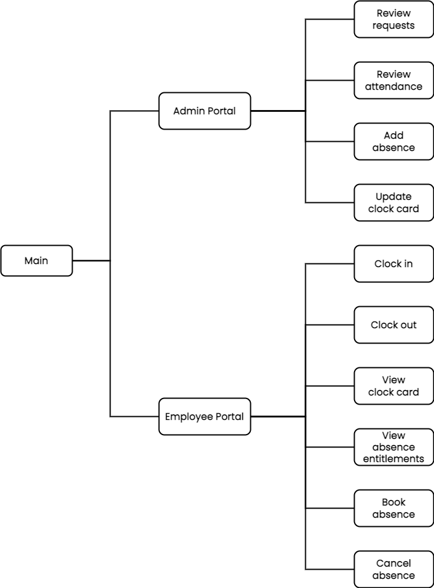
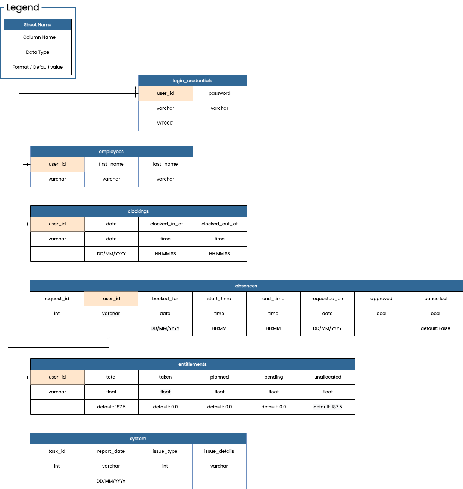

# WORK TIME - Employee Time Management System

_WORK TIME_ is an employee time management system which runs in an SSH terminal in a browser. The application will be targeted towards small business owners that are looking for an effective way to manage their employees' schedules. It provides an employee clocking system, attendance tracking and absence management.

__NOTE__: This application can only be operated properly on a desktop computer browser.

 

# Table of Contents

[User Experience (UX)](#user-experience-ux)
- [Application Goals](#application-goals)
- [Target Audience](#target-audience)
- [User Stories](#user-stories)
- [Strategy Table / Diagram](#strategy-table--diagram)
- [Application Structure](#application-structure)
- [Wireframe](#wireframe)

[Data Model](#data-model)

 

# User Experience (UX)

## Application Goals

- To provide a time management system that optimises the productivity of employees by automating idle routines such as recording clocking times, time-off entitlements and group absences.
- To deliver information as intuitively as possible by providing descriptive messages and a clear content structure.

## Target Audience

small business owners, supervisors and their employees

## User Stories

- As a superuser (business owner / supervisor),
    - I want the login credentials to be secure so that an unauthorised person cannot access the admin account.
    - I want to be able to reset my password so that I can access the system even when I forget it.
    - I want to be able to review each employee's attendance record so that I can manage the team more effectively.
    - I want to be able to review a list of all requests easily so that I don't miss anything.
    - I want to be able to see the team's availability so that I can easily determine whether I can approve or reject new absence requests.
    - I want to be notified when there's a new request so that I can proceed as soon as possible.
    - I want the system to programmatically generate payslips so that I can avoid idle and error-prone routines.
    - I want to be able to add a new employee to the system so that they can start using the system immediately.

 

- As a user (employee),
    - I want a simple log-in process so that I can complete my task as quickly as possible.
    - I want an easy to use system so that I can complete my task as quickly as possible.
    - I want to be able to check my absence entitlements so that I can plan my holidays as quickly as possible.
    - I want to be able to book and cancel my holidays on the system so that I don't have to email my manager or update it on the Excel spreadsheet.
    - I want to be able to review worked hours so that I can flag it to the manager immediately if it's inaccurate.
    - I want to be able to check who's out of the office at a glance so that I can arrange meetings / events on a day when the relevant members are in.

## Strategy Table / Diagram

The strategy table and diagram have been created to decide on what features should be implemented in this project. The listed features are based on the user stories. Each feature's importance and viability / feasibility were rated on a scale of 1 to 5 where 5 is the most important and the most viable / feasible.

## Application Structure

Based on the strategy rating, I have decided to implement the following features: Log in(Feature ID 1), Clock in/out(3), Book/Cancel/Approve/Reject time-off(4), Review Clock in/out time(7), Review absence entitlements(8), Review group absence(9).

The application will be structured as shown in the following diagram.

## Wireframe

 

# Data Model

_Google Sheets_ was chosen to store and retrieve data as most small/start-up companies typically have this tool available and the volume of the data for this project will be small. The python implementation will be able to support a SQL or NoSQL database with minimal refactoring when the volume of data requires it.
The spreadsheet has 5 main worksheets: login_credentials, employees, clockings, absences and entitlements and 1 supporting worksheet for reporting issues to the system administrator.
 
Each employee’s login id will be stored in the login_credentials sheet and will be the key to link to other worksheets to CRUD(create, read, update, delete) data when the user interacts with the application.
 
I have created a diagram to visualise each sheet and its columns.
 
