# Table of Contents

- [HTML Validation](#html-validation)
- [CSS Validation](#css-validation)
- [Python Validation](#python-validation)

## HTML Validation

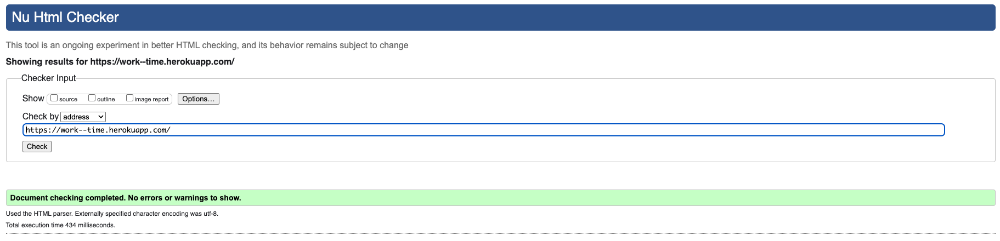

[Back To **Table of Contents**](#table-of-contents)

 

## CSS Validation

- Validation

    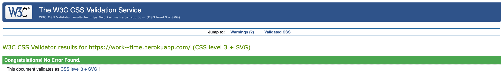

- Warning

    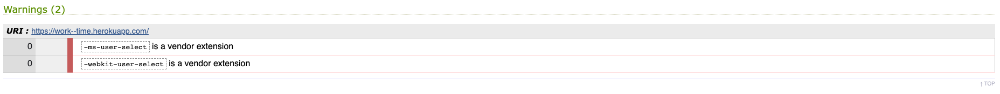

    The warnings are caused by the use of vendor prefixes: `ms` and `webkit`. As these are for supporting cross-browser compatibility, I decided not to remove them.

[Back To **Table of Contents**](#table-of-contents)

 

## Python Validation

- `run.py`

    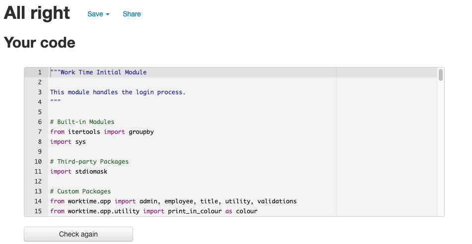

- Packages

    - `app`

        - `admin.py`

            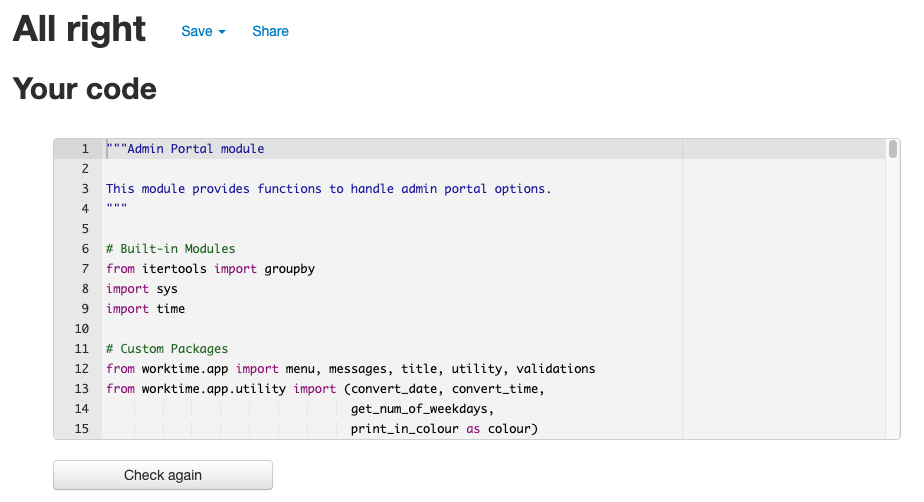

        - `employee.py`

            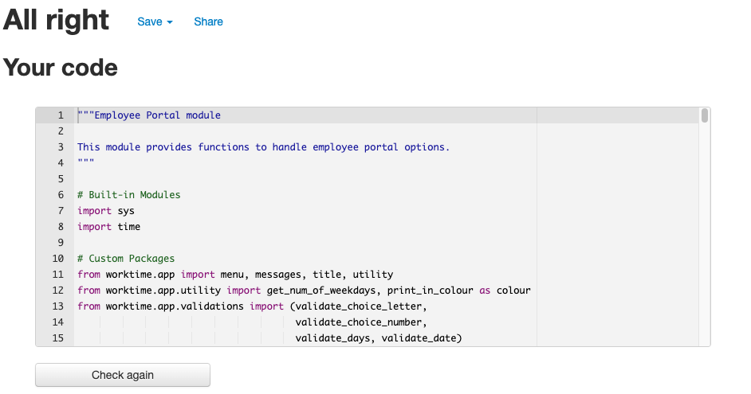

        - `menu.py`

            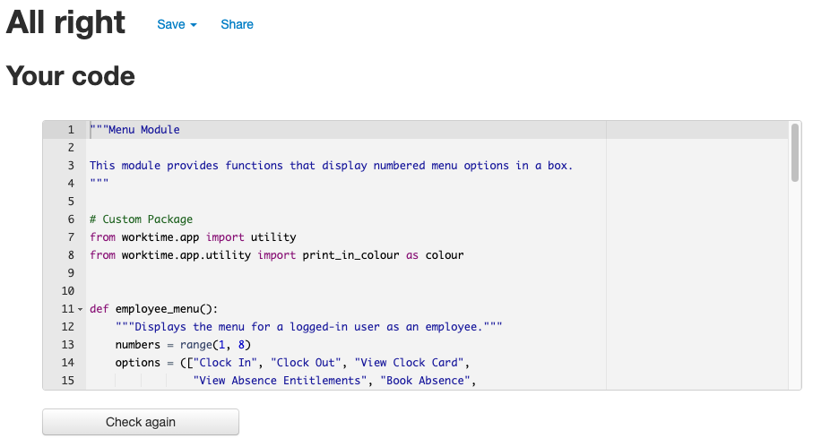

        - `messages.py`

            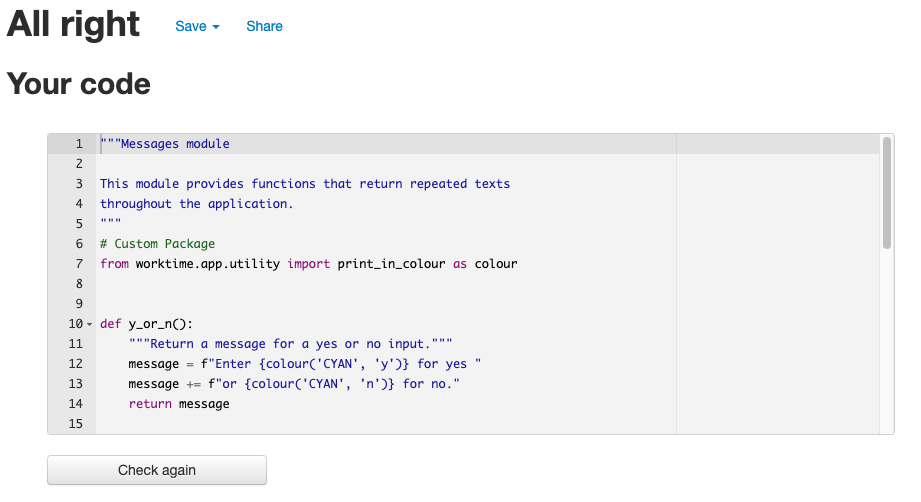

        - `title.py`

            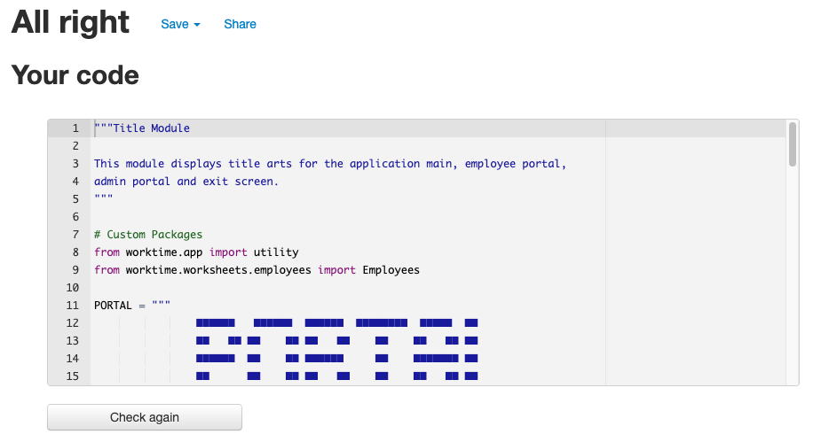

        - `utility.py`

            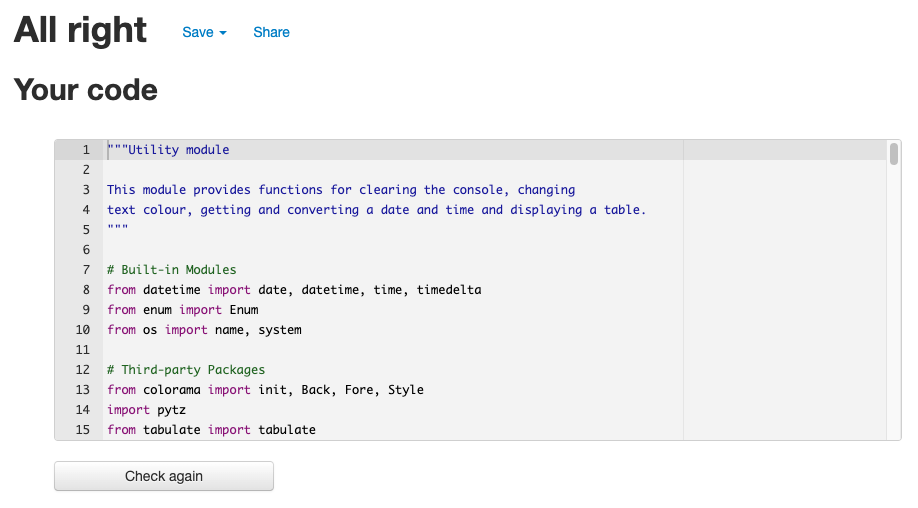

        - `validations.py`

            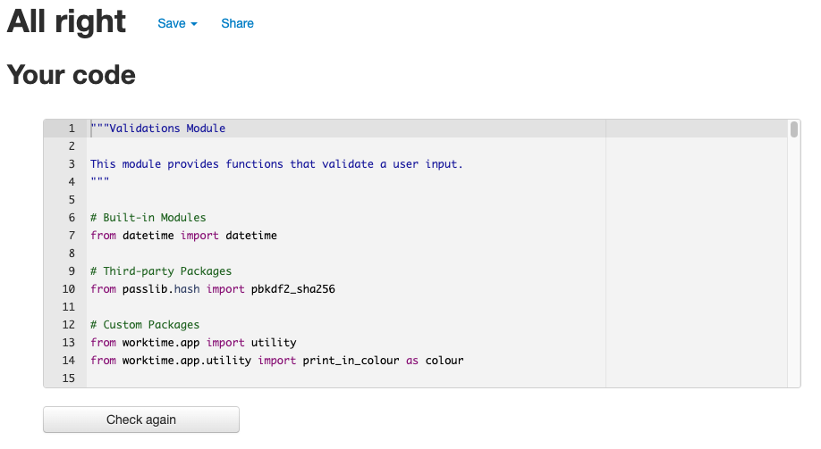

    - `worksheets`

        - `auth.py`

            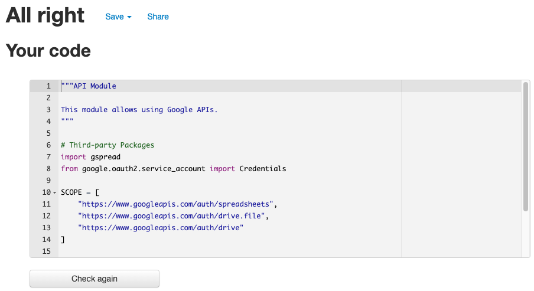

        - `clockings.py`

            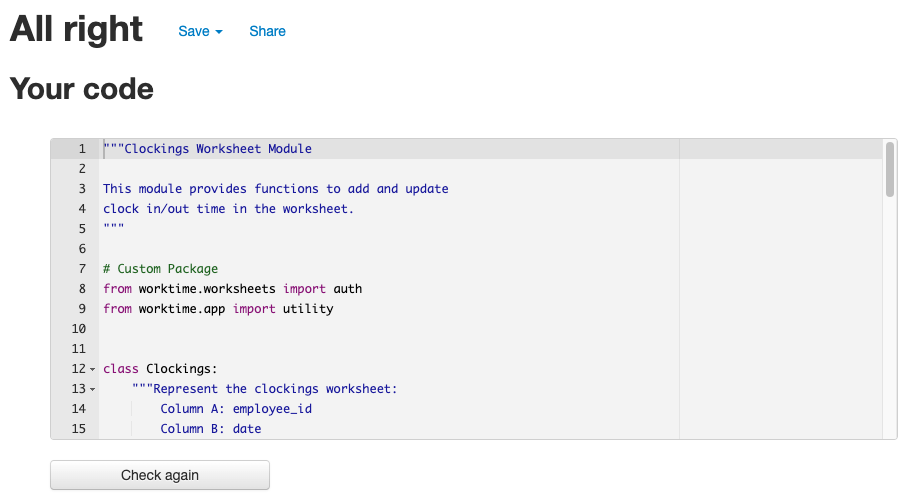

        - `credentials.py`

            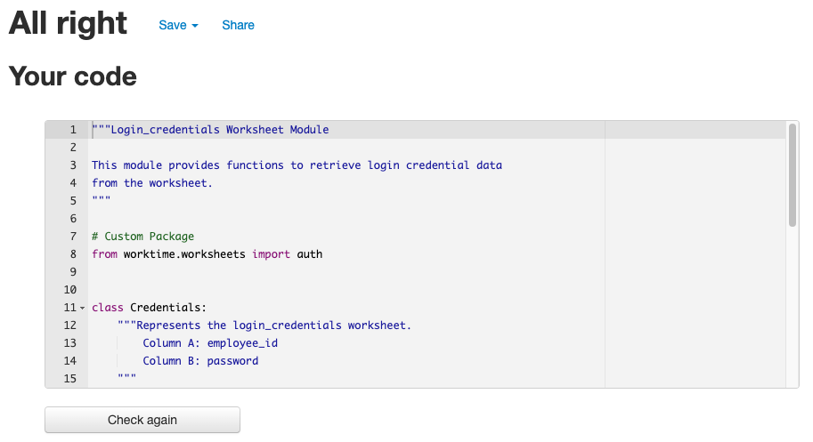

        - `employees.py`

            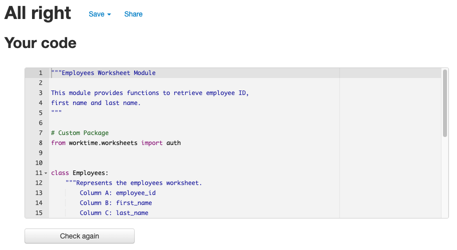

        - `entitlements.py`

            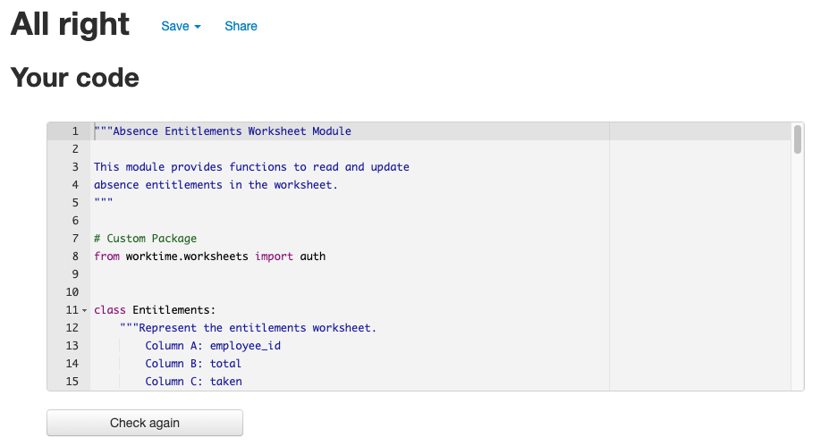

        - `requests.py`

            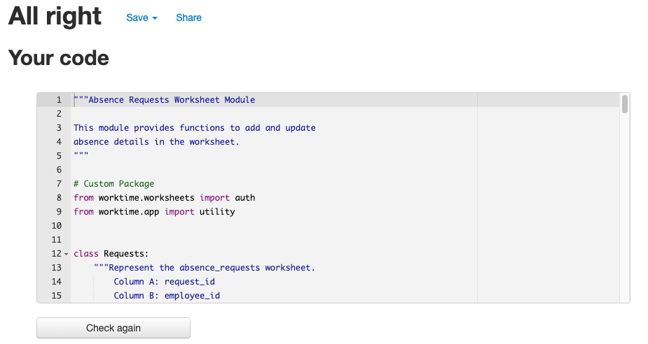

[Back To **Table of Contents**](#table-of-contents)